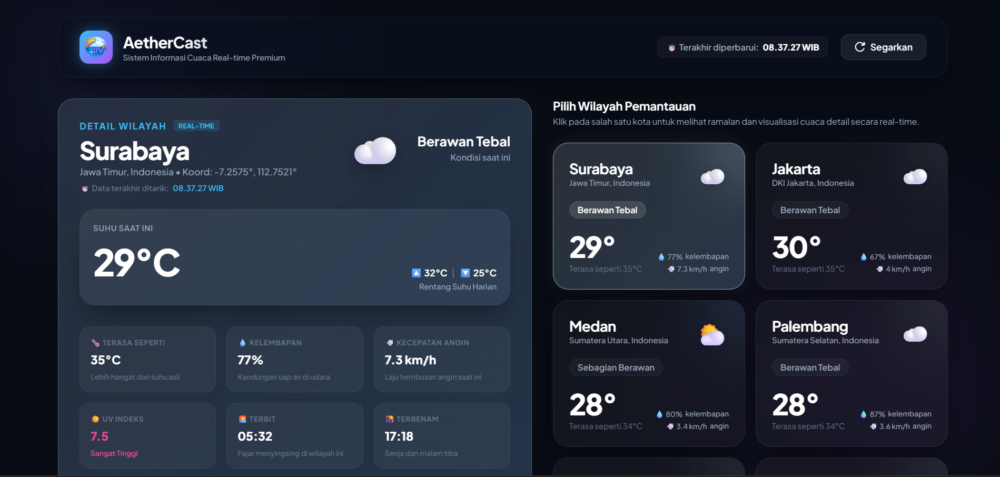

# AetherCast

A modern weather dashboard built with React.js that displays real-time weather information using the Open-Meteo API. This project focuses on component-based architecture, dynamic UI rendering, and responsive frontend development.

---

## Preview

<a href="https://dickyzibran.github.io/AetherCast/" target="_blank">
  Click here to view
</a>



---

## Features

- Real-time weather information
- Responsive user interface
- Component-based architecture
- Dynamic rendering using props
- Clean and modern design
- Fast development environment with Vite

---

## Tech Stack

- React.js
- Vite
- JavaScript
- CSS
- Open-Meteo API

---

## API Reference

Weather data is provided by:

- https://open-meteo.com/

---

## Installation

Clone the repository:

```bash
git clone https://github.com/letmekyx/Weather.git
```

Navigate to the project directory:

```bash
cd weather
```

Install dependencies:

```bash
npm install
```

Run the development server:

```bash
npm run dev
```

Open in browser:

```bash
http://localhost:5173
```

---

## Learning Objectives

This project was created to practice:

- React component structure
- Props and state management
- API integration
- Responsive layout development
- Modern frontend workflow using Vite

---

## License

This project is open for educational and personal development purposes.
